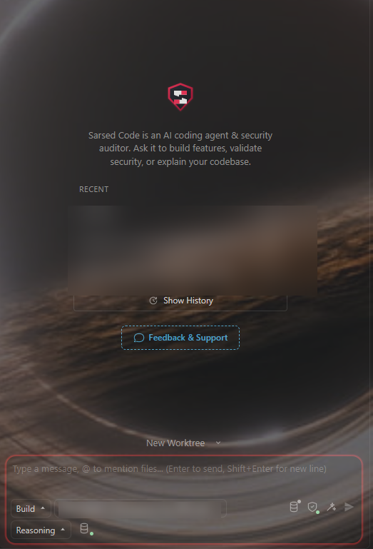

<p align="center">
  
</p>

<h1 align="center">Sarsed Code</h1>

<p align="center">
  <strong>Next-Generation AI Coding & Security Engineering Assistant for VS Code</strong><br>
  <em>Powered by Zero-Mem Architecture, Editorial Typography, and Autonomous Security Orchestration.</em>
</p>

<p align="center">
  <a href="https://github.com/sarsvankelsion/sarsed-code/releases"></a>
  <a href="https://github.com/sarsvankelsion/sarsed-code/blob/main/LICENSE"></a>
  <a href="https://github.com/sarsvankelsion/zero-mem"></a>
  <a href="https://github.com/sarsvankelsion/sarsed-code"></a>
</p>

<p align="center">
  
</p>

---

## Overview

**Sarsed Code** is an advanced open-source AI coding and security engineering extension for Visual Studio Code. Built on a high-performance agentic foundation, Sarsed Code integrates the breakthrough **Zero-Mem** memory architecture, refined editorial typography, and specialized multi-agent operating modes.

Whether you are authoring clean application code, auditing critical codebases for vulnerabilities, or reverse-engineering binary formats, Sarsed Code orchestrates local and cloud intelligence with complete deterministic control.

---

## Key Highlights

### 🧠 Zero-Mem Architecture (0 Token Cost)

```text
________ ___________  ____             _____   ____   _____  
\___   // __ \_  __ \/  _ \   ______  /     \_/ __ \ /     \ 
 /    /\  ___/|  | \(  <_> ) /_____/ |  Y Y  \  ___/|  Y Y  \
/_____ \\___  >__|   \____/          |__|_|  /\___  >__|_|  /
      \/    \/                             \/     \/      \/ 
```

> **Zero-Mem Subsystem**: Built upon research from **The Hong Kong Polytechnic University (HK PolyU)** (*Zero-Mem: Zero-Token Memory Operations for LLM Agents*, arXiv:2607.29377). Standalone library available at [sarsvankelsion/zero-mem](https://github.com/sarsvankelsion/zero-mem).

- **Zero-Token Memory Operations**: Replaces lossy, expensive LLM-based memory summaries with deterministic trace substrates, BM25 indexing, dense hashing, and Personalized PageRank (PPR) graph propagation.
- **Dual-Projection**: Full human-editable `.md` projection (`memory.md`) bidirectionally synchronized with fast structured traces.
- **Context Budgeting**: Real-time context estimation and token budget enforcement with strict `assertZeroToken` verification.

### 🛡️ Specialized Operating Modes
- **Build Mode**: End-to-end execution of coding requests with direct multi-file editing, diagnostics resolution, and unit tests.
- **Plan Mode**: Read-only codebase investigation, drafting comprehensive, evidence-based architectural plans before any modification.
- **Sarsed Mode**: Application security testing orchestrator for authorized assessments (SAST/DAST, attack-surface mapping, vulnerability PoC validation, and automated regression-tested patches).
- **Reverse Mode**: Reverse engineering, binary analysis, protocol decoding, and APK decompilation with deterministic priority ladder routing (`MASTER-ROUTING.md`).
- **Skill Hunter Mode**: Autonomous discovery, evaluation, and injection of external skills and MCP tools from GitHub to fulfill specialized requirements.

### 🎨 Humanized Editorial Typography
- Bundles Google's high-legibility **Newsreader** serif typography for chat interactions and reasoning thought streams, drastically reducing reading fatigue.
- Preserves high-contrast monospace rendering for code blocks, git diffs, and tabular data.

### 🎛️ Interactive Memory Selector
- Switch seamlessly between memory policies right from the prompt bar: **Zero-Mem**, **Read & Write**, **Read-Only**, or **Disabled**.
- Live visual indicators for reserved memory tokens, context limits, and active session provenance.

---

## Repository Architecture

```text
sarsed-code/
├── packages/
│   ├── kilo-vscode/       # VS Code Extension frontend & Webview UI (React, Vite, CSS)
│   ├── kilo-memory/       # Memory engine: Zero-Mem substrate, graph propagation, md-layer
│   ├── kilo-ui/           # Reusable UI component library and styling
│   ├── opencode/          # Agent core runtime, tool dispatch, and providers
│   ├── kilo-i18n/         # Internationalization dictionary support
│   └── sdk/               # OpenCode TypeScript SDK and schema generation
├── patches/               # Workspace patches for dependencies
└── package.json           # Monorepo root configuration (Bun & Turbo)
```

---

## Building from Source

### Prerequisites
- [Bun](https://bun.sh/) 1.2+ (or 1.4+)
- Node.js 20+
- Git

### Quickstart

1. **Clone the repository:**
   ```bash
   git clone https://github.com/sarsvankelsion/sarsed-code.git
   cd sarsed-code
   ```

2. **Install dependencies:**
   ```bash
   bun install
   ```

3. **Run Unit Tests:**
   ```bash
   # Test memory-selector, typography, and modes
   cd packages/kilo-vscode
   bun test tests/unit/memory-selector.test.ts tests/unit/sarsed-modes.test.ts tests/unit/typography.test.ts

   # Test Zero-Mem engine
   cd ../kilo-memory
   bun test test/zero-e2e.test.ts
   ```

4. **Package the VS Code Extension (.vsix):**
   ```bash
   cd packages/kilo-vscode
   bun run vsce:package
   ```
   The resulting `.vsix` installer will be generated in `packages/kilo-vscode/`.

5. **Install into VS Code:**
   ```bash
   code --install-extension packages/kilo-vscode/sarsed-code-7.7.0.vsix
   ```

---

## Related Repositories

- **[zero-mem](https://github.com/sarsvankelsion/zero-mem)**: Standalone zero-token memory operations engine & benchmark suite based on HK PolyU research.
- **[sarsed](https://github.com/sarsvankelsion/sarsed)**: Private security knowledge base, specialized skill packs (vulnerabilities, reverse-skill, frameworks), and agent configurations.

---

## License

MIT License. See [LICENSE](./LICENSE) for details.
